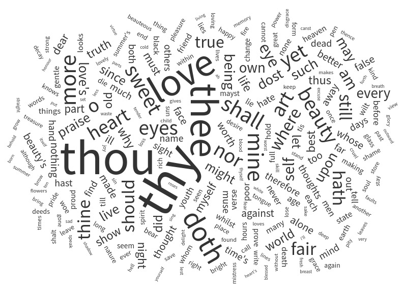

<!-- NUBE -->
<picture> 
   
</picture>

<h1 align="center"> Welcome! </h1> 

<h2 align="center">
CAROLINA GARAY
</h2>

<h2 align="center">
Data Scientist | Data Analyst | Data Engineer | Astrophysicist
</h2>

- I studied Data Science at [Henry](https://www.soyhenry.com/) and Astrophysicist at [UNSJ](https://www.unsj.edu.ar/)
- I’m looking to collaborate on Data Science

### 🛠 &nbsp;Tech Stack and Tools

 
  
 
  
  
  

 
  
  
  
 
 
  
  
 
 
 
 

  
  
 
  
  
  

  

